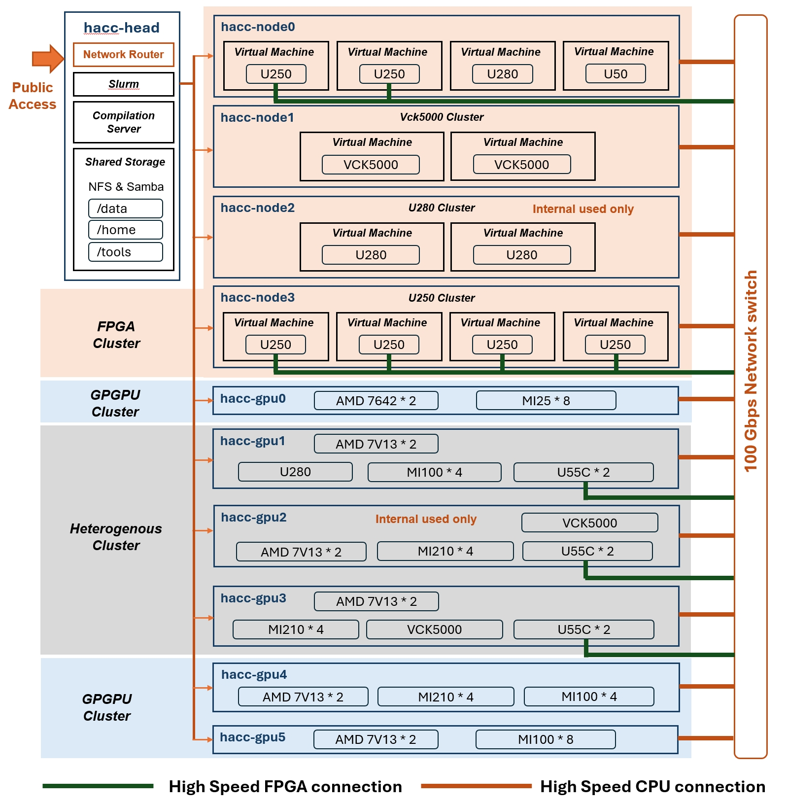

## HACC Demo

This repo provides some useful tool scripts and examples to demonstrate how to use the available FPGA resources in HACC@NUS cluster.

- [Demo 0: Login HACC@NUS](doc/0-login.md)
- [Demo 1: FPGA allocation](doc/1-FPGA-allocation.md)
- [Demo 2: Use VNC for waveform-based simulation](doc/2-waveform-based-simulation.md)
- [Demo 3: 100G networking](doc/3-100G-network-interaction.md)
- [Demo 4: VCK5000 exploration](doc/4-VCK5000.md)
- [Demo 5: U250 DFX-2RP](doc/5-U250_DFX.md)
- [Demo 6: AMD GPU HIP application](doc/6-HIP.md)

## Hardware Overview

## Software Environment

The hardware compilation environment and hardware shell version for different hardware are shown in the table below. 

|Cluster|  Hardware | Shell/Arch Version | XRT Version | Toolchain Version|
|-------------------|----------------|--------------------|-------------|-------------------|
| Heterogeneous Cluster |VCK5000 | xilinx_vck5000_gen4x8_qdma_2_202220_1 | 2.14.384  | Vitis 2022.2 |
|                  | U55C   | xilinx_u55c_gen3x16_xdma_3_202210_1 | 2.14.384   | Vitis 2022.2 |
|                  | U250 | xilinx_u250_gen3x16_xdma_4_1_202210_1 | 2.14.384   | Vitis 2022.2 |
|                  |MI210 | gfx90a  | -   | ROCm-5.4.2 |
| GPU Cluster | MI25    | gfx906  | -  | ROCm-5.4.2 |
|  | MI100    | gfx908  | -  | ROCm-5.4.2 |
| U250 Cluster  |  U250     | xilinx_u250_gen3x16_xdma_3_1_202020_1  | 2.14.354   | Vitis 2021.2 |
| U280 Cluster |  U280    | xilinx_u280_xdma_201920_3  | 2.14.354    | Vitis 2021.2 |
| VCK5000 Cluster  | VCK5000     | xilinx_vck5000_gen4x8_qdma_2_202220_1     |2.14.384   | Vitis 2022.2 |
| U50 Single Node |  U50   | xilinx_u50_gen3x16_xdma_201920_3  | 2.14.354    | Vitis 2021.2 |

## License

Copyright (c) 2023 Xtra Computing Group, NUS, Singapore.

Permission is hereby granted, free of charge, to any person obtaining a copy
of this software and associated documentation files (the "Software"), to deal
in the Software without restriction, including without limitation the rights
to use, copy, modify, merge, publish, distribute, sublicense, and/or sell
copies of the Software, and to permit persons to whom the Software is
furnished to do so, subject to the following conditions:

The above copyright notice and this permission notice shall be included in all
copies or substantial portions of the Software.

THE SOFTWARE IS PROVIDED "AS IS", WITHOUT WARRANTY OF ANY KIND, EXPRESS OR
IMPLIED, INCLUDING BUT NOT LIMITED TO THE WARRANTIES OF MERCHANTABILITY,
FITNESS FOR A PARTICULAR PURPOSE AND NONINFRINGEMENT. IN NO EVENT SHALL THE
AUTHORS OR COPYRIGHT HOLDERS BE LIABLE FOR ANY CLAIM, DAMAGES OR OTHER
LIABILITY, WHETHER IN AN ACTION OF CONTRACT, TORT OR OTHERWISE, ARISING FROM,
OUT OF OR IN CONNECTION WITH THE SOFTWARE OR THE USE OR OTHER DEALINGS IN THE
SOFTWARE.